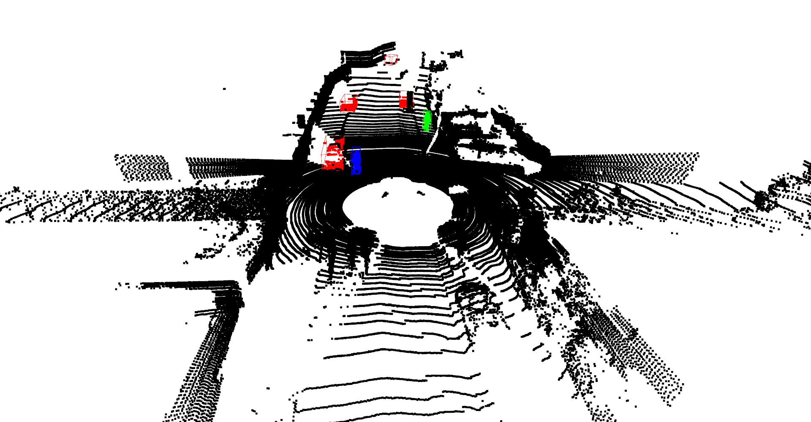

# BIGBOSS_FoX 大作业

## 作业完成情况：

- [x] Step 1. Remove the ground from the lidar points
- [x] Step 2. Clustering over the remaining points
- [x] Step 3. Classification over the clusters
- [x] Step 4. Report the detection precision-recall for three categories: vehicle, pedestrian, cyclist

## 作业具体流程完成情况：

- [x] Write helper class and methods for processing KITTI object detection data: `kitti_util.py`
- [x] Visualize KITTI classification data ("Vehicle": red, "Pedestrian": green, "Cyclist": blue) along with its ground truth bbox from KITTI object detection data: `explore_kitti_obj.py`
- [x] Extract KITTI classification data ("Vehicle", "Pedestrian", "Cyclist", "GO") from KITTI object detection data: `extract_kitti_cls.py`
- [x] Build KITTI classification dataset: `dataset.py`
- [x] Construct KITTI classification models (PointNet, VFE, VFE_LW): `models.py`
- [x] Train KITTI classification models (PointNet, VFE, VFE_LW) and validate performances on validation set: `train.py`
- [x] Fit a cuboid over object detected as vehicle / pedestrian / cyclist: `infer.py`
- [x] Generate object detection results for KITTI: `infer.py`
- [x] Generate new labels by merging "Car", "Van", "Truck", "Tram" into "Vehicle": `convert_labels.py`
- [x] Evaluate object detection results and generate PR curvers: `../kitti_eval/evaluate_object_3d_offline`

## 作业+数据文件目录：

```
├─ data									# not included in the zip file
	├─ kitti							# kitti_obj_dir
		├─ ImageSets
			├─ train.txt
			├─ val.txt
			├─ test.txt
			├─ trainval.txt
		├─ training
			├─ calib
			├─ image_2
			├─ label_2
			├─ my_label_2				# generated by convert_labels.py
			├─ velodyne
		├─ testing
			├─ calib
			├─ image_2
			├─ velodyne
	├─ kitti_cls						# kitti_cls_dir
		├─ train
			├─ Vehicle
				├─ 0.txt
				├─ ...
			├─ Pedestrian
				├─ 0.txt
				├─ ...
			├─ Cyclist
				├─ 0.txt
				├─ ...
			├─ GO
				├─ 0.txt
				├─ ...
		├─ val
			├─ Vehicle
				├─ 0.txt
				├─ ...
			├─ Pedestrian
				├─ 0.txt
				├─ ...
			├─ Cyclist
				├─ 0.txt
				├─ ...
			├─ GO
				├─ 0.txt
				├─ ...
├─ BIGBOSS_FoX-大作业					# root_dir
	├─ codes
		├─ kitti_util.py
		├─ explore_kitti_obj.py
		├─ extract_kitti_cls.py
		├─ ground_segmentation_object_clustering.py		# own implementation of RANSAC, DBSCAN, copied from the 4th homework, not used due to DBSCAN being too slow
		├─ octree.py				# copied from the 4th homework, own implementation of octree
		├─ result_set.py			# copied from the 4th homework, helper classes for data structures that store kNN and radiusNN results
		├─ convert_labels.py
		├─ dataset.py
		├─ infer.py
		├─ models.py
		├─ train.py
	├─ documents
		├─ README.md
		├─ 说明文档.pdf
		├─ xxx.png							# all screenshots
	├─ kitti_eval
		├─ results
			├─ data					# inference results
			├─ plot					# evaluation PR curves
		├─ evaluate_object_3d_offline
		├─ evaluate_object_3d_offline.cpp
		├─ mail.h
	├─ runs
		├─ train
			├─ PointNet
				├─ exp1		# trained on dirty data
				├─ exp2		# trained on clean data
			├─ VFE
				├─ exp1		# trained on dirty data
				├─ exp2		# trained on clean data
			├─ VFE_LW
				├─ exp1		# trained on dirty data
				├─ exp2		# trained on clean data
```

## 作业环境:

- python 3.7
- torch 1.9.0
- numpy 1.19.5
- scipy 1.7.1
- open3d 0.13.0
- opencv-python 4.5.3.56

## 作业讲解：

### 1. `kitti_util.py`:

 - 代码讲解：

   部分代码参考：

   - [kitti-3d-visual-python](https://github.com/Poley97/kitti-3d-visual-python)
   - [kitti_object_vis](https://github.com/kuixu/kitti_object_vis)
   - [3d 目标检测 判断点云是否在bbox中](https://blog.csdn.net/qq_35632833/article/details/106865648)
- [Algorithm to find the minimum-area-rectangle for given points in order to compute the major and minor axis length](https://stackoverflow.com/questions/13542855/algorithm-to-find-the-minimum-area-rectangle-for-given-points-in-order-to-comput)
  
   将各种跟处理kitti object detection data相关的方法包装进KittiData类中，主要包含各种在cam_2, cam_0, velo, image之间坐标系互相投影的方法(坐标系参见[Sensor Setup](http://www.cvlibs.net/datasets/kitti/setup.php))，获取velo坐标系下的3d bbox的八个角坐标的方法，将标签"Car", "Van", "Truck", "Tram"转换成标签"Vehicle"的方法，截取照片fov内的点云的方法，判断点云是否在3d bbox里的方法, 利用凸包寻找最小面积外接矩形的方法，拟合点云簇的3d bbox的方法, 在点云和照片上可视化3d bbox的方法等。

### 2. `explore_kitti_obj.py`:

- 代码讲解：

  用index读取相应点云文件，截取照片fov内的点云，遍历对应label文件里的label信息，将标签"Car", "Van", "Truck", "Tram"转换成标签"Vehicle"，获取velo坐标系下的3d bbox的八个角坐标，用判断点云是否在3d bbox里的方法截取对应3d bbox内的点云。

- 代码运行方式：

  ```bash
  $ cd codes
  $ python explore_kitti_obj.py [--root_dir ../../data/kitti] \
  							  [--file_idx 5876]
  ```

- 结果:

  - 点云全景+bbox：
  
    
    
  - 照片fov内的点云+bbox：
  
    
  
  - 照片+bbox：
  
    

### 3. `extract_kitti_cls.py`:

- 代码讲解：

  建立"kitti_cls"数据集，用ImageSets里的`train.txt`, `val.txt`作为train_val_split，将label的3d bbox包含的点云存到各自label名称的文件夹中，然后将"Vehicle", "Pedestrian", "Cyclist"的点云从照片fov的点云中去除，然后用RANSAC去除地面（自己实现的RANSAC和open3d的RANSAC api都可以使用，我暂时先选用后者，注释掉了前者），用DBSCAN获取"GO"的clusters（自己实现的DBSCAN速度比较慢，我选用open3d中的cluster_dbscan api），将他们保存到"GO"文件夹。

  我提取了两轮数据：

  - 第一轮：以下俗称"dirty data"，只刷掉bbox里少于10个点的样本，并保留了所有GO样本。数量如下：

    | Split | Vehicle | Pedestrian | Cyclist | GO    |
    | ----- | ------- | ---------- | ------- | ----- |
    | train | 14681   | 2090       | 684     | 39746 |
    | val   | 15784   | 2225       | 842     | 37749 |

  - 第二轮：以下俗称"clean data"，"Vehicle"刷掉小于200个点的样本，"Pedestrian"刷掉小于50个点的样本，"Cyclist"刷掉小于10个点的样本，"GO"最多采集5000个。数量如下：

    | Split | Vehicle | Pedestrian | Cyclist | GO   |
    | ----- | ------- | ---------- | ------- | ---- |
    | train | 5850    | 1487       | 684     | 5000 |
    | val   | 6715    | 1785       | 842     | 5003 |

- 代码运行方式：

  ```bash
  $ cd codes
  $ python extract_kitti_cls.py [--kitti_obj_dir ../../data/kitti] \
  							  [--kitti_cls_dir ../../data/kitti_cls] \
  							  [--veh_inlier_thres 200] \
  							  [--ped_inlier_thres 50] \
  							  [--cyc_inlier_thres 10] \
  							  [--go_count_lmt 5000] \
  							  [--ransac_dist_thres 0.2] \
  							  [--ransac_n 3] \
  							  [--ransac_num_iters 1000] \
  							  [--dbscan_eps 1] \
  							  [--dbscan_min_points 50]
  ```

- 结果：

  - 去除ground truths (代码中请先解除相应位置的可视化代码):

    

  - RANSAC去除地面 (代码中请先解除相应位置的可视化代码):

    

  - DBSCAN得到GO聚类 (代码中请先解除相应位置的可视化代码):

    

### 4. `dataset.py`:

- 代码讲解：

  建立KITTI分类数据集"KittiClsDataset"。

  - label设置：

    0: Vehicle

    1: Pedestrian

    2: Cyclist

    3: GO

  - augmentation设置：

    1. 多于1000个点的点云随机降采样到1000点，不足1000点的在后面补值全为0的点到1000点。
    2. 点云绕velo的z轴随机旋转一个角度。
    3. 对输入数据点标准化为zero-mean，unit-variance，如果有std为0的情况，给std加个很小的数值防止分母为0的情况出现。

  - 应对不平衡数据的设置：

    每个分类设置一个权重 = 1 / 分类数据个数，分类数据越多，这个权重越低，把权重输入PyTorch里的WeightedRandomSampler里实例化后送入之后的DataLoader里。

- 代码运行方式：

  为了测试WeightedRandomSampler效果，测试代码对train set建了两个train loader，一个没有WeightedRandomSampler另一个有。然后各自跑1 epoch，显示各分类采样数量。

  ```bash
  $ cd codes
  $ python dataset.py
  ```

- 结果：

  - 没有WeightedRandomSampler：

    ```
    label counter: {0: 5850, 3: 5000, 1: 1487, 2: 684}
    ```

  - 有WeightedRandomSampler：

    ```
    label counter: {0: 3340, 3: 3267, 1: 3181, 2: 3233}
    ```

    

### 5. `models.py`:

- 代码讲解：

  搭了PointNet，VFE和VFE_LW (light-weight version of VFE)。PointNet结构和第五章作业一样。VFE的大概结构是第一层PointNet最后的point-wise feature经最大池化后得到第一层的全global feature，然后把这个global feature叠到每个point-wise feature里，再输入第二层PointNet，最后经过带dropout的全连接得到4分类的向量。后面在训练模型时发现这个VFE模型占了接近12G显存，就相应把模型的一些参数改小了一点，作为VFE_LW。

### 6. `train.py`:

- 代码讲解：

  训练脚本。train_set和val_set的划分是按照`data/kitti/ImageSets`里的`train.txt`和`val.txt`里的索引号来划分。分别给PointNet，VFE，VFE_LW在dirty data（exp1）和clean data（exp2）下各训练了一个版本模型权重。

- 代码运行方式：

  ```bash
  $ cd codes
  $ python train.py [--model PointNet <or> VFE <or> VFE_LW] \
  				  [--exp exp1 <or> exp2]
  ```

  ```bash
  $ cd codes
  $ tensorboard --logdir ../runs/train
  ```

- 结果：

  - train/val loss/acc:

    

    val loss反弹的三条曲线均为在dirty data上训练时造成的，可见大量点数少特征相似的训练样本使模型为了区分它们而过拟合了。

  - 分类准确度，以每个模型的best val acc为标准：

    - PointNet/exp1:

      ```
      Epoch: [73 / 100]	Val_Loss: 0.8938	Val_Acc: 49587 / 56600 (87.61%)	Time: 63.78s
      ```

    - PointNet/exp2:

      ```
      Epoch: [94 / 100]	Val_Loss: 0.3074	Val_Acc: 13456 / 14345 (93.80%)	Time: 21.41s
      ```

    - VFE/exp1:

      ```
      Epoch: [34 / 100]	Val_Loss: 0.7498	Val_Acc: 48867 / 56600 (86.34%)	Time: 253.78s
      ```

    - VFE/exp2:

      ```
      Epoch: [69 / 100]	Val_Loss: 0.2967	Val_Acc: 13321 / 14345 (92.86%)	Time: 64.77s
      ```

    - VFE_LW/exp1:

      ```
      Epoch: [27 / 100]	Val_Loss: 0.6832	Val_Acc: 48900 / 56600 (86.40%)	Time: 60.19s
      ```

    - VFE_LW/exp2:

      ```
      Epoch: [43 / 100]	Val_Loss: 0.2808	Val_Acc: 13207 / 14345 (92.07%)	Time: 20.93s
      ```

      

### 7. `infer.py`:

- 代码讲解:

  推理脚本。分两个功能：

  1. 如果在命令行提供点云的index，就用训练好的模型在这个index对应的点云进行模型推理并分布可视化推理的过程和对应的真值。
  2. 如果不提供点云index，就会对val set里的所有点云进行模型推理并将推理结果按KITTI的格式写入`../kitti_eval/results/data`中。

  推理流程：

  1. 获取image fov里的点云。
  2. 去地面（RANSAC）并聚类（DBSCAN）。
  3. 把所有cluster的tensor叠成tensor batch，送入模型推理，得到raw inference result。
  4. 拟合所有cluster的3d bbox，并以如下指标淘汰一些false positive的分类结果，得到processed inference result：
     - Vehicle：高度在[1, 2.5]之间，短边大于1，长边小于10。
     - Pedestrian：高度在[1.2, 2]之间，短边大于0.2，长边小于3，短边不能大于高度。
     - Cyclist：高度在[1.2, 2]之间，短边大于0.2，长边小于3，短边不能大于高度。

- 代码运行方式：

  模型权重我选择了`../runs/train/PointNet/exp2/checkpoints/latest.tar`。

  - 对单个点云推理可视化：

    ```bash
    $ cd codes
    $ python infer.py --file_idx 7301
    ```

  - 生成val set的推理结果：

    ```bash
    $ cd codes
    $ python infer.py
    ```

- 结果：

  - point cloud groundtruths:

    

  - image groundtruths:

    

  - clusters:

    

  - raw inference result:

    

  - processed inference result:

    

  - processed inference result on image:

    

  - inference result in KITTI format (example not related to 7301):

    ```
    Cyclist -1 -1 -10 420.6201 165.1389 431.1390 193.0212 1.4010 1.0661 0.2149 -9.4284 1.0194 36.8359 -0.0395 0.8315
    Vehicle -1 -1 -10 305.1302 183.0905 558.3006 309.6591 1.6660 4.3176 2.1288 -2.7231 1.8616 12.0467 -0.3173 1.0000
    Vehicle -1 -1 -10 677.2825 185.5175 843.1778 285.2899 1.5230 1.5784 3.5459 2.5231 1.7719 13.1704 -1.3327 0.9976
    Vehicle -1 -1 -10 715.4489 180.6001 1044.2978 359.7754 1.5880 1.6104 3.4603 2.7931 1.6928 8.3631 -1.1678 1.0000
    ```


### 8. `convert_labels.py`:

- 代码讲解：

  因为官方的label是有"car", "van", "truck", "tram"，所以重新生成新的label，这4种车统一写为"vehicle"，保存到`../../data/kitti/training/my_label_2`中。

- 代码运行方式：

  ```bash
  $ cd codes
  $ python convert_labels.py
  ```

- 结果：

  生成的label范例：

  ```
  Vehicle 0.00 0 -1.73 517.23 162.98 564.36 196.64 1.60 1.76 3.84 -3.47 0.53 36.37 -1.83
  Vehicle 0.00 0 -1.67 443.60 168.03 480.35 195.69 1.39 1.56 3.45 -7.78 0.51 38.09 -1.87
  Vehicle 0.00 1 -1.65 427.54 165.14 455.37 185.51 1.41 1.66 3.76 -12.08 0.00 52.01 -1.88
  DontCare -1 -1 -10 252.46 147.28 278.92 166.87 -1 -1 -1 -1000 -1000 -1000 -10
  DontCare -1 -1 -10 313.46 150.42 402.28 160.91 -1 -1 -1 -1000 -1000 -1000 -10
  DontCare -1 -1 -10 407.46 153.56 418.99 161.96 -1 -1 -1 -1000 -1000 -1000 -10
  DontCare -1 -1 -10 495.19 143.11 514.03 155.69 -1 -1 -1 -1000 -1000 -1000 -10
  ```


### 9. `../kitti_eval/evaluate_object_3d_offline.cpp`:

- 代码讲解:

  评估程序。做如下修改：

  1. 把所有"car"替换成"vehicle"。

  2. 第55行改成:

     ```cpp
     const double MIN_OVERLAP[3][3] = {{0.2, 0.2, 0.2}, {0.2, 0.2, 0.2}, {0.2, 0.2, 0.2}};
     ```

- 代码运行方式：

  - 编译：

    ```bash
    $ cd kitti_eval
    $ g++ -O3 -DNDEBUG -o evaluate_object_3d_offline evaluate_object_3d_offline.cpp
    ```

  - 执行评估：

    ```bash
    $ cd kitti_eval
    $ ./evaluate_object_3d_offline /home/cdy/Projects/shenlan_3D_Point_Clouds/data/kitti/training/my_label_2 results
    ```

- 结果：

  - 评估流程信息：

    ```
    Thank you for participating in our evaluation!
    Loading detections...
    number of files for evaluation: 3769
      done.
    save results/plot/vehicle_detection.txt
    vehicle_detection AP: 43.832798 26.743456 26.686005
    fontconfig: Didn't find expected font family. Perhaps URW Type 1 fonts need installing? when opening font Helvetica, trying default
    PDFCROP 1.38, 2012/11/02 - Copyright (c) 2002-2012 by Heiko Oberdiek.
    ==> 1 page written on `vehicle_detection.pdf'.
    save results/plot/pedestrian_detection.txt
    pedestrian_detection AP: 35.031731 32.710197 28.223368
    fontconfig: Didn't find expected font family. Perhaps URW Type 1 fonts need installing? when opening font Helvetica, trying default
    PDFCROP 1.38, 2012/11/02 - Copyright (c) 2002-2012 by Heiko Oberdiek.
    ==> 1 page written on `pedestrian_detection.pdf'.
    save results/plot/cyclist_detection.txt
    cyclist_detection AP: 23.352108 10.363353 10.601734
    fontconfig: Didn't find expected font family. Perhaps URW Type 1 fonts need installing? when opening font Helvetica, trying default
    PDFCROP 1.38, 2012/11/02 - Copyright (c) 2002-2012 by Heiko Oberdiek.
    ==> 1 page written on `cyclist_detection.pdf'.
    save results/plot/vehicle_detection_ground.txt
    vehicle_detection_ground AP: 35.405029 26.600039 26.462751
    fontconfig: Didn't find expected font family. Perhaps URW Type 1 fonts need installing? when opening font Helvetica, trying default
    PDFCROP 1.38, 2012/11/02 - Copyright (c) 2002-2012 by Heiko Oberdiek.
    ==> 1 page written on `vehicle_detection_ground.pdf'.
    save results/plot/pedestrian_detection_ground.txt
    pedestrian_detection_ground AP: 32.714958 27.889343 26.264084
    fontconfig: Didn't find expected font family. Perhaps URW Type 1 fonts need installing? when opening font Helvetica, trying default
    PDFCROP 1.38, 2012/11/02 - Copyright (c) 2002-2012 by Heiko Oberdiek.
    ==> 1 page written on `pedestrian_detection_ground.pdf'.
    save results/plot/cyclist_detection_ground.txt
    cyclist_detection_ground AP: 19.371134 8.960316 9.068620
    fontconfig: Didn't find expected font family. Perhaps URW Type 1 fonts need installing? when opening font Helvetica, trying default
    PDFCROP 1.38, 2012/11/02 - Copyright (c) 2002-2012 by Heiko Oberdiek.
    ==> 1 page written on `cyclist_detection_ground.pdf'.
    save results/plot/vehicle_detection_3d.txt
    vehicle_detection_3d AP: 35.276058 26.476469 26.318571
    fontconfig: Didn't find expected font family. Perhaps URW Type 1 fonts need installing? when opening font Helvetica, trying default
    PDFCROP 1.38, 2012/11/02 - Copyright (c) 2002-2012 by Heiko Oberdiek.
    ==> 1 page written on `vehicle_detection_3d.pdf'.
    save results/plot/pedestrian_detection_3d.txt
    pedestrian_detection_3d AP: 32.637028 27.835989 26.201281
    fontconfig: Didn't find expected font family. Perhaps URW Type 1 fonts need installing? when opening font Helvetica, trying default
    PDFCROP 1.38, 2012/11/02 - Copyright (c) 2002-2012 by Heiko Oberdiek.
    ==> 1 page written on `pedestrian_detection_3d.pdf'.
    save results/plot/cyclist_detection_3d.txt
    cyclist_detection_3d AP: 19.371134 8.943304 9.046829
    fontconfig: Didn't find expected font family. Perhaps URW Type 1 fonts need installing? when opening font Helvetica, trying default
    PDFCROP 1.38, 2012/11/02 - Copyright (c) 2002-2012 by Heiko Oberdiek.
    ==> 1 page written on `cyclist_detection_3d.pdf'.
    Your evaluation results are available at:
    results
    ```

  - PR Curves:

    - vehicle_detection_3d:

      

    - pedestrian_detection_3d:

      

    - cyclist_detection_3d:

      

      